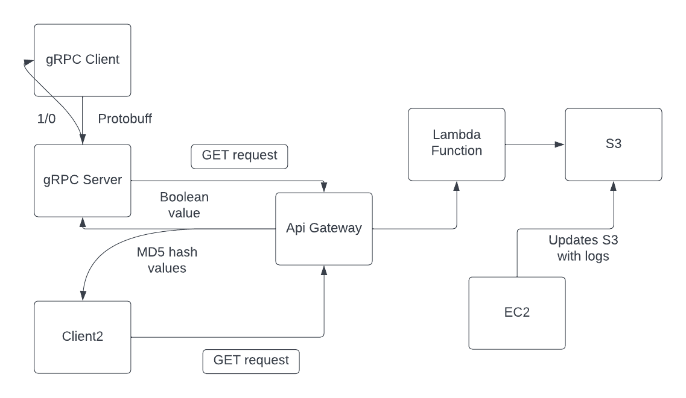

<h1>Homework 2 - gRPC, Http Rest, EC2, Lambda</h1>

<h2>Submission by: Sasanka Mouli Subrahmanya Sri Veleti</h2>

<h2>Objective of the Project:</h2>
<p>To design and implement gRPC client - server and HTTP Rest Client to consume Restful API exposed by a serverless lambda function through API gateway and achieve the following tasks:</p>
<ol>
<li>To deduce if a given timestamp is present in AWS S3 bucket or not using a algorithm which searches in O(logn) time complexity</li>
<li>If the timestamp is present take a delta time as input and return MD5 hash value of all the logs between this delta time interval which match the user defined regex.</li>
</ol>

<p style="font-size: 20px">The detailed explanation of the log file generation, algorithm used, implementation of clients and lambda function are discussed below.</p>

<p style="font-size: 20px">And the explanation video is linked <a href="https://youtu.be/qGdTAYKOGKY" target="_blank">here.</a></p>

<h3>Environment and Dependencies used to set up this project</h3>
<ul>
    <li>Operating System: Windows 11 Enterprise, Version - 21H2</li>
    <li>IDE: IntelliJ IDEA Ultimate 2022.2.2</li>
    <li>Java Version - 11.0.16</li>
    <li>Scala Version- 3.1.3, sbt - Version 1.7.2 </li>
</ul>
<h3>Flow diagram and project structure:</h3>
<p>The following flow diagram depicts the architecture of the project</p>



Explanation of the architecture intially the gRPC client gets an input of a timestamp and the gRPC client makes a request to gRPC server using protobuf and gRPC server in turns make call to REST API exposed by API Gateway calling lambda and gets a bool value telling whether the timestamp is present in the log file or not. The Http client is implemented using AkkaHTTP also makes a call to lambda with a timestamp and delta and gets a boolvalue and a list of MD5 hash values.

The project when cloned has two folders one which has the gRPC Client - Server, AkkaHttpClient the other folder has the lamdba function which is deployed on the AWS.

<h3>Deployment of LogfileGenerator on EC2 instance</h3>

<p> The main task here is to generate log files and store them into AWS S3 bucket.</p>
<p>Inorder to achieve this I have followed the following steps:</p>
<ol>
<li>We have to first create an IAM role which allows S3 access from the EC2</li>
<li>Now, from EC2 console select launch instance</li>
<li>Name the instance and choose the AMI - for my case I have chosen Amazon linux as it comes with yum package manager pre installed.</li>
<li>Next, generate the key pair file</li>
<li>Leave rest of the entries as defaults and click launch instance.</li>
<li>This will create the instance</li>
<li>Now from the command line of your local system lets connect to the instance created</li>
<li>We ssh to connect to the instance and make sure the key pair generated is properly pointed</li>

```
ssh -i "logfilegeneratorec2.pem" ec2-user@ec2-13-59-90-59.us-east-2.compute.amazonaws.com
```
<li>Once connected lets install git, sbt, jdk, aws cli so that we can run out logfilegenerator application. In order to do that run following commands</li>

```
sudo yum install git
```

```
sudo yum install sbt
```

```
sudo amazon-linux-extras install java-openjdk11
```

```
sudo yum install awscli
```

<li>Now clone this <a href="https://github.com/0x1DOCD00D/CS441_Fall2022">repository</a> change directory to LogFileGenerator</li>
<li>Now compile and run the project</li>

```
sbt clean compile run
```

<li>The log file would have been generated cd in to the logs directory, lets copy it to S3 using the following command</li>

```
aws s3 cp <log-file name> s3://<bucket-name>
```

This process can be automated writing a simge bash script

Now the logs are ready.
</ol>

<h3>Defining and Deploying a AWS Lambda Function</h3>

<p>AWS Lambda is a serverless compute service that runs your code in response to events and automatically manages the underlying compute resources for you - from AWS documentation</p>

<p>Steps to create lambda function:</p>

<ol>
<li>Once you are in AWS lambda dashboard</li>
<li>Create a function, define the function name, select the runtime - in this case it is Python 3.9</li>
<li>In the permissions section choose existing role and choose the role which has S3FullAccess and Cloudwatchlogs creation. If not already present create roles from the IAM console.</li>
<li>Click create function and paste or write the code in the code editor and monitor the logs in cloudwatch</li>
</ol>

<h4>Explanation of code behind lambda function</h4>

<p>The lambda function takes 4 query parameters - type, inputtimestamp, regex, delta. The program checks for the type
and exceutes according to the type of functionality. The first type where we check whether the given time stamp
is in the log file or not. Inorder to perform this task we make use of binary search which runs in O(logn) time
complexity. The second type where we have to return MD5 hash values if the given timestamp is in log file, if not
we can return 404 status. To know the start log and end log in the log file we perform binary search with start time
and end time of the time interval given.</p>

<h3>Creation of API Endpoint for exposing lambda function as a Restful Service</h3>

<ol>
<li>Once in API Gateway dashboard</li>
<li>Click create API</li>
<li>Choose REST API and click build</li>
<li>Define the API name and Create the API</li>
<li>From Actions dropdown create a resource and define the resource name and resource path then click create resource</li>
<li>Select the resource path and click actions dropdown create method and set the method as GET.</li>
<li>Choose lambda integration, choose lambda proxy integration and select the lambda function to be used and save.</li>
<li>Now lets deploy the API from the actions dropdown choose deploy API, define a new stage and enter the stage name and click deploy.</li>
<li>Now the endpoint is ready to be consumed. For testing we can make use of CURL command or clients like postman</li>
</ol>
The endpoint for my lambda function is as follows

https://34ymq6qdql.execute-api.us-east-2.amazonaws.com/test/checktimestamp

It takes in 4 query parameters namely
<ol>
<li><b>timestamp</b> -  to timestamp to search</li>
<li><b>type</b> - the type of result(1 or 2) to return i.e 1 for boolvalue for whether the timestamp is present in the log and 2 for list of MD5 hash values when the timestamp is present.
<li><b>regex</b> - the regex to search for in the given time interval</li>
<li><b>delta</b> - the delta time</li>
</ol>

Now let's consume the Rest API created.

<h3>gRPC Client - Server</h3>

The gRPC framework uses protobuf inorder to communicate between nodes. The protobuf for this client and server is defined as TimeCheck.proto. In order run the gRPC server and client, follow the following steps:

<ol>
<li>Clone this repository and change directory to gRPC_Rest</li>

```
cd gRPC_Rest
```
<li>Compile and run tests on the project</li>

```
sbt clean compile test
```
<li>Now, we will start the server</li>

```
sbt "runMain gRPC.gRPCServer"
```

The server starts and waits for requests

<li>Now, let's make a client request along with arguments of timestamp to check whether the timestamp is present in log file or not. Note that the time timestamp should be in the format of "%H:%M:%S.%f"</li>

```
sbt "runMain gRPC.gRPCClient 23:20:00.142"
```

This results in a boolean status of whether timestamp is present or not. If the following log is printed then the timestamp is in the S3 bucket.

```
13:47:39.242 [sbt-bg-threads-1] INFO  gRPC.gRPCClient - ********The Timestamp given is in the S3 Bucket, you can proceed with other actions******
13:47:39.243 [sbt-bg-threads-1] INFO  gRPC.gRPCClient - The response received is: 1
```

Both server and client are hosted locally.
</ol>

<h3>Client 2 - To get the MD5 hash values</h3>

The client 2 uses AkkaHTTP to make a GET request to the API endpoint in the following format

https://34ymq6qdql.execute-api.us-east-2.amazonaws.com/test/checktimestamp?timestamp=23:18:26.0&type=2&regex="*"&delta=0:18:26.0

Now let's run the client

<ol>
<li>First we will compile and test</li>

```
sbt clean compile test
```
<li>Now let's run the client, the AkkaHttpClient takes two arguments namely timestamp and delta, both should be of the format "%H:%M:%S.%f"</li>

```
sbt "runMain Client2.AkkaHttpClient 23:20:00.142 0:0:16.0"
```
<li>below are the results along with hash values</li>

```
14:03:08.524 [sbt-bg-threads-1] INFO  Client2.AkkaHttpClient - ************* The bool value of whether the timestamp is in s3 is 1
14:03:08.525 [sbt-bg-threads-1] INFO  Client2.AkkaHttpClient - ************* The hash values are List([
"711eca10cc9990daf5eeb06384e003b2",
"6d811665f664e4bc048a55369e167156",
"29f4cbdb4f633904e034f9fd570f30e0",
"cd54e7684725b834586eaaf461efe01e",
"be8a94249d5db010471be1f9544512af",
"d0a619885b55ca687454f80bb36567cd",
"8ef367f212375ec11d046c0a088c4326",
"f4c8f9b1831438890c457621aca8b5b8",
"4c0723b4912c627ecc26f8719789228c",
"bd34d5f78999db4dae38ec449e491082",
"6cfe47717bf2b8929656df726781930b",
"7ae5da82d8439377fba6fea20b0c2b1e"
])
```
</ol>

<h3>Test cases</h3>
<p>The test cases are written in MRTesterClass under src/test/scala and the test cases are as follows</p>
<ol>
<li>To get correct endpoint defined in application config</li>
<li>To get correct port for gRPC connected in application config</li>
<li>To check the validity of the given input timestamp and delta</li>
<li>To return correct URL formed for rest request</li>
<li>To check whether the give timestamp present or not test</li>
</ol>


